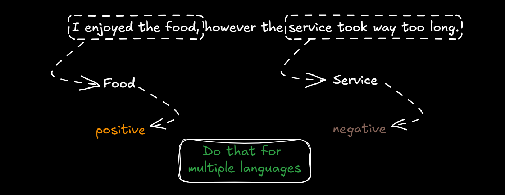
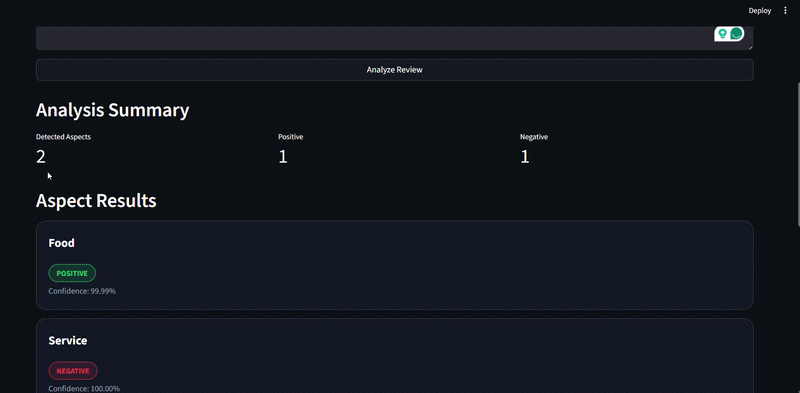

# DeepX-Hackathon-2026 ( NLP )


## 🚀Aspect-Based Sentiment Analysis (ABSA)

A production-style **Arabic Aspect-Based Sentiment Analysis system** designed to understand **real-world, noisy customer feedback** and analyze sentiment for each mentioned aspect individually.

---

## 🎯 Challenge Objective

This project was developed as part of an ABSA challenge where the goal is to move beyond traditional sentiment classification into **fine-grained understanding of user reviews**.

Instead of assigning one sentiment to a whole review, the system:

* Extracts **multiple aspects** from a single review
* Assigns **independent sentiment** to each aspect
* Handles **mixed sentiment within the same sentence**
* Generalizes across **multiple domains** (not just restaurants)

---

## 🧠 Our Approach

We designed a **two-stage pipeline**:

### 1️⃣ Aspect Extraction Model

* Detects all aspects mentioned in the review (multi-label classification)
* Handles noisy Arabic text and mixed contexts

### 2️⃣ Aspect-Level Sentiment Model

* Takes `(text + aspect)` as input
* Predicts sentiment:

  * Positive
  * Negative
  * Neutral

### 💡 Why this approach?

We separated the problem into two steps because:

* Aspect detection and sentiment understanding require **different representations**
* Improves modularity → each model can be improved independently
* Easier debugging and scaling
* Closer to real-world production systems

---

## 🏷️ Aspect Taxonomy

The system predicts only from the following predefined classes:

```text
food, service, price, cleanliness, delivery, ambiance, app_experience, general, none
```

---

## 📊 Model Performance

> ⚠️ Replace these values with your real results

### 🔹 Aspect Extraction Model

* F1 Score (Micro): **85.8%**
* Precision: **85%**
* Recall: **86%**

### 🔹 Sentiment Classification Model

* Accuracy: **94.2%**
* F1 Score: **94%**
* Precision: **90%**

---

## 🔍 Example

### 📝 Input Review

```text
تجربة سيئة، الاكل كان كويس لكن الخدمة كانت بطيئة جدا
```

---

### 🧠 Step 1: Aspect Extraction

```json
["food", "service"]
```

---

### ❤️ Step 2: Sentiment per Aspect

```json
{
  "food": "positive",
  "service": "negative"
}
```

---

## 🖥️ Demo (UI)

We built a modern interactive dashboard using **Streamlit** that allows users to:

* Input customer reviews
* View extracted aspects
* See sentiment for each aspect
* Analyze confidence scores
* Visualize sentiment distribution

---

## ⚙️ Installation & Setup

### 1️⃣ Clone the repository

```bash
git clone https://github.com/ai-mohamed-mamdouh/DeepX-Hackathon-2026.git
cd DeepX-Hackathon-2026
```

---

### 2️⃣ Create virtual environment

```bash
python -m venv .venv
```

Activate it:

#### Windows:

```bash
.venv\Scripts\activate
```

#### Mac/Linux:

```bash
source .venv/bin/activate
```

---

### 3️⃣ Install dependencies

```bash
pip install -r requirements.txt
```

---

### 4️⃣ Download Models

Download trained models from Google Drive:
* 👉 **aspect_model** : **[https://drive.google.com/drive/folders/1ZYGM01hAvRzQ7NugobkaWyW0BTDvyE7R?usp=sharing]**
* 👉 **sentiment_model** : **[https://drive.google.com/drive/folders/1DhjNplnKGotTMFBISaGVTvtVvoSfx7sB?usp=sharing]**

After downloading:

* Place models inside the project directory:

```text
project/
│
├── models/
│   ├── aspect_model/
│   └── sentiment_model/
```

> ⚠️ Make sure paths match what your code expects

---

## ▶️ Run the Application

```bash
streamlit run app.py
```

---

## 📦 Project Structure

```text
.
├── app.py
├── aspect_inferance.py
├── sentiment_inferance.py
├── models/
├── requirements.txt
└── README.md
```

---

## 🧪 Generalization

Our system is designed to work across multiple domains:

* 🍔 Restaurants
* 🚚 Delivery services
* 📱 Mobile applications
* 🏥 Healthcare
* 🛍️ Retail

---

## 🏆 Evaluation Criteria

The solution is evaluated based on:

* **ABSA Performance (30%)** → F1 Score (Micro)
* Data Handling
* Model Design
* UI / Deployment
* Presentation Quality

---

## 🔥 Key Highlights

* Handles **Arabic noisy text**
* Supports **multi-aspect detection**
* Captures **mixed sentiment**
* Clean, modular architecture
* Production-ready UI

---

## 👨‍💻 Team

> Add your team info here

---

## 📌 Future Work

* Improve low-resource aspect detection
* Add multilingual support
* Deploy as API
* Integrate real-time feedback systems

---

## ⭐ If you like this project

Give it a star ⭐ on GitHub!

---
